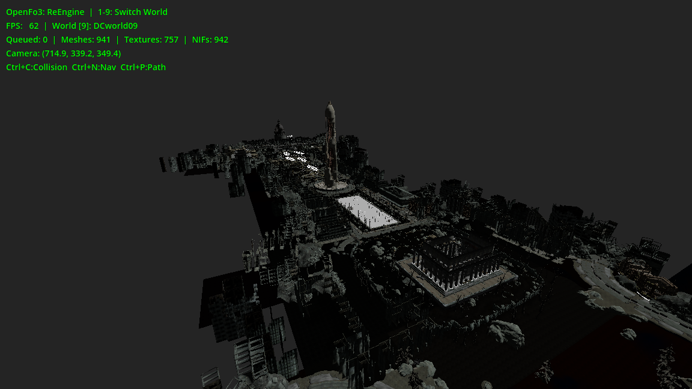
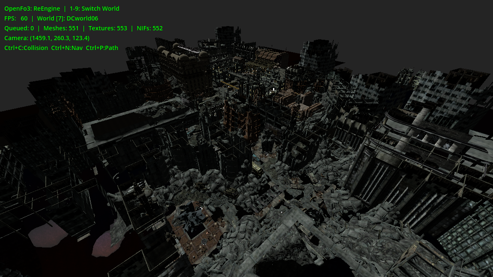

# Fallout 3: Re Engine

Fallout 3をRedot Engineで再構成する実験的なプロジェクトです。
ゲームアセットなどは内蔵しておらず、オリジナルゲームデータを直接使用します。

---

## 実装

- [x] 環境構築
- [x] ESMの読み込み
- [x] NFIの読み込み
- [x] モデルの読み込み
- [x] パーティクルの読み込み
- [x] メガトンの町を読み込み
- [x] 他の場所にも対応
- [x] 地形の読み込み
- [x] テクスチャの読み込み
